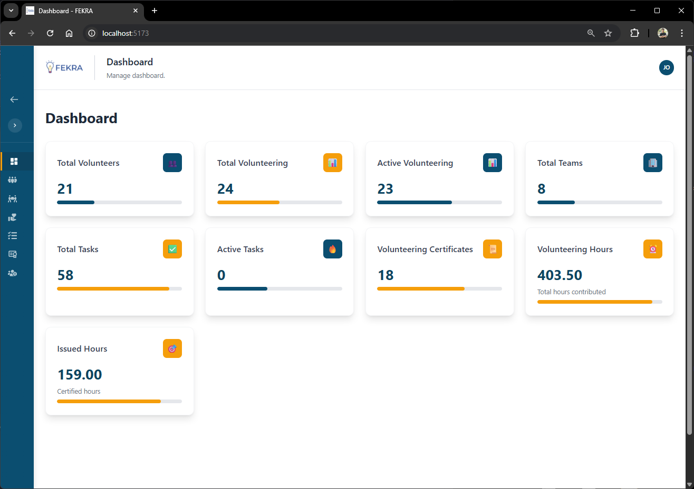
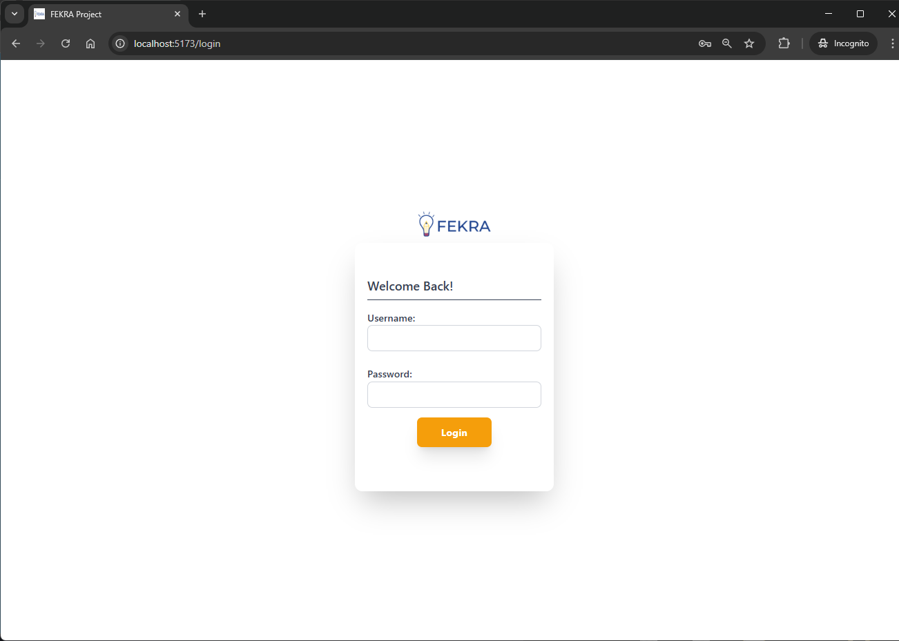
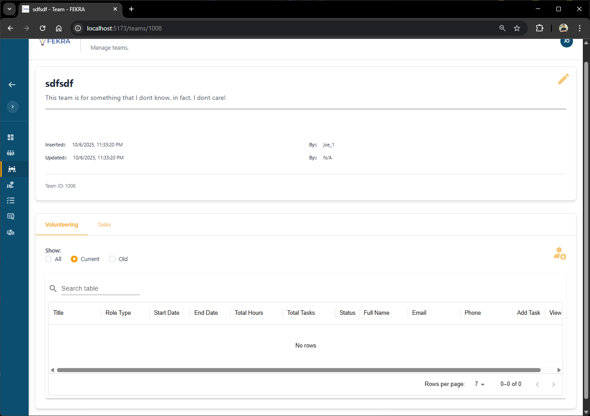
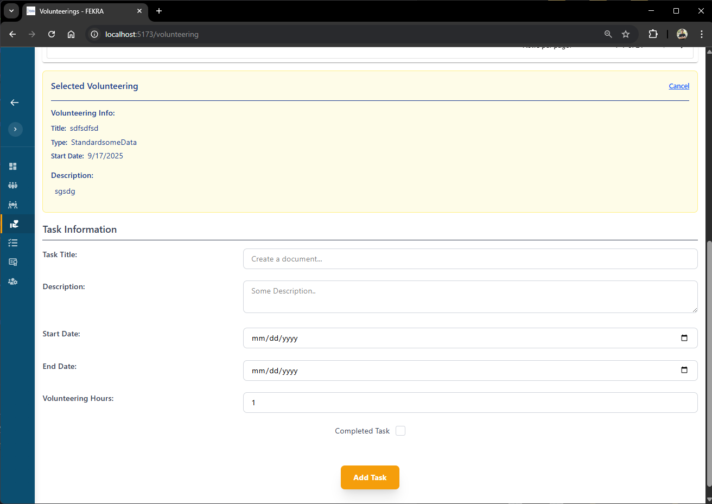
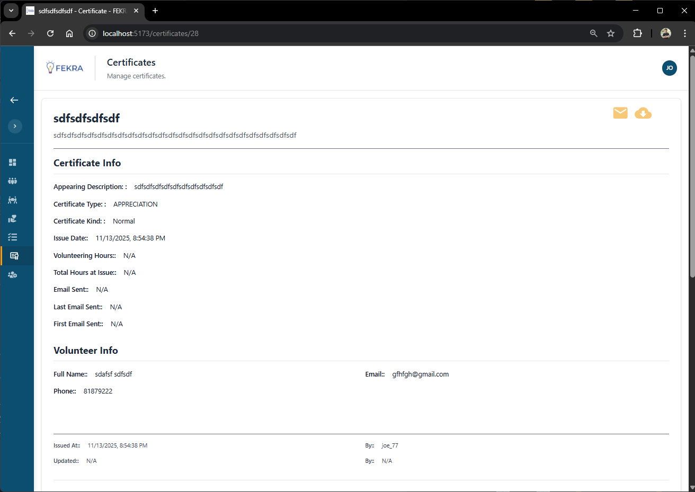
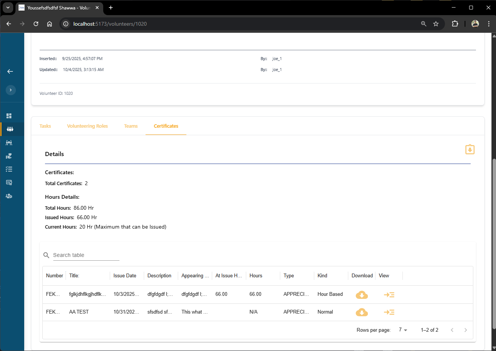

# Volunteering Management System



## Overview

A modern, responsive Volunteering Management System built with React.js and Tailwind CSS. This frontend application provides comprehensive tools for managing volunteers, volunteering activities, teams, tasks, and certificates with secure authentication.

## Features

### Authentication & Security

- **Secure Login System** with form validation
- **Two-Step Verification** for enhanced security
- Protected routes and session management (now using the php session, will implement node.js express.js later)




### Volunteer Management

- **Create, Read, Update** volunteer profiles
- Volunteer information tracking


### Volunteering Management

- Organize and manage volunteering roles in teams.
- Track participation and hours


### Team Management

- Create and manage volunteer teams
- Track team statistics.



### Task Management

- Create and assign tasks to volunteering roles in a team.
- Track task progress and completion



### Certificate Generation (backend based, now using php dompdf)

- Not available now as the backend not available.
- Create volunteering certificates for a volunteer and send.
- Customizable certificate templates
- Certificate tracking and distribution





## Technology Stack

- **Frontend Framework:** React.js 19+
- **Styling:** Tailwind CSS
- **Icons:** React Icons
- **State Management:** React Context API
- **Form Handling:** Custome Hook.
- **Routing:** React Router DOM.

## Installation

### Prerequisites

- Node.js (version 16 or higher)
- npm or yarn package manager

### Setup Instructions

1. **Clone the repository**

   ```bash
   git clone https://github.com/your-username/volunteering-management-system.git
   cd volunteering-management-system
   npm install
   npm run dev / npm start
   ```

2. Please note that this app, needs backend in order to work, as its depending on the login page, and 2 step verification in order
   work.
